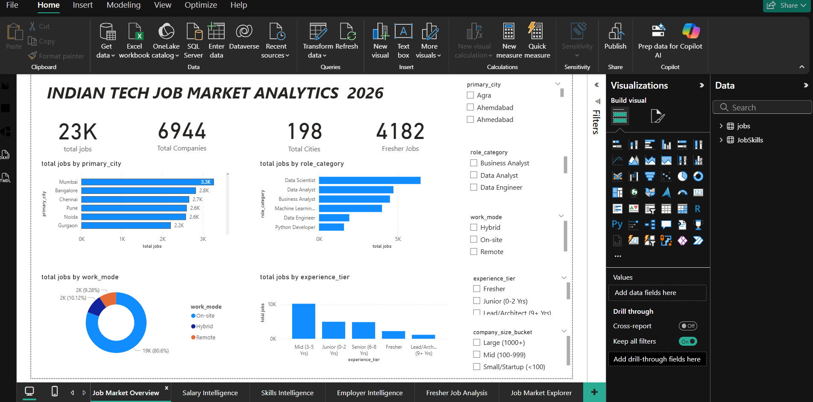
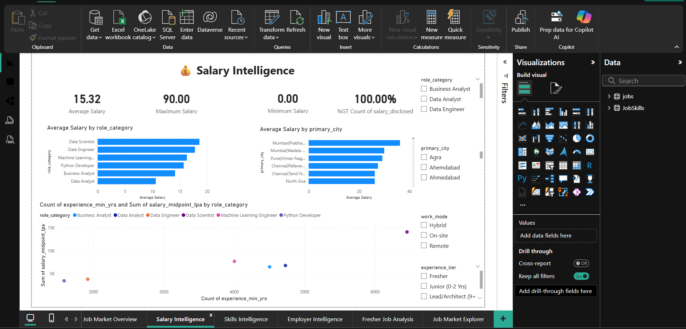
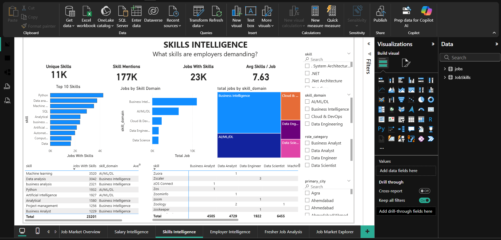
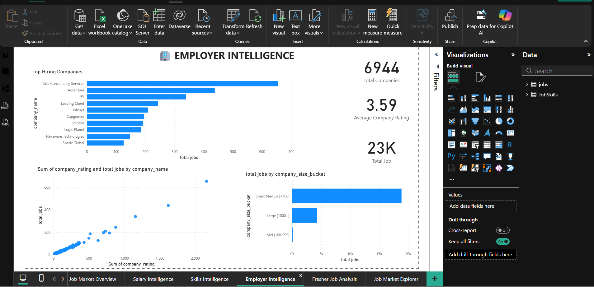
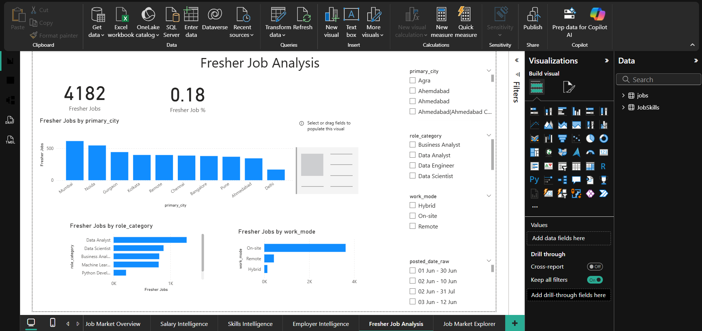
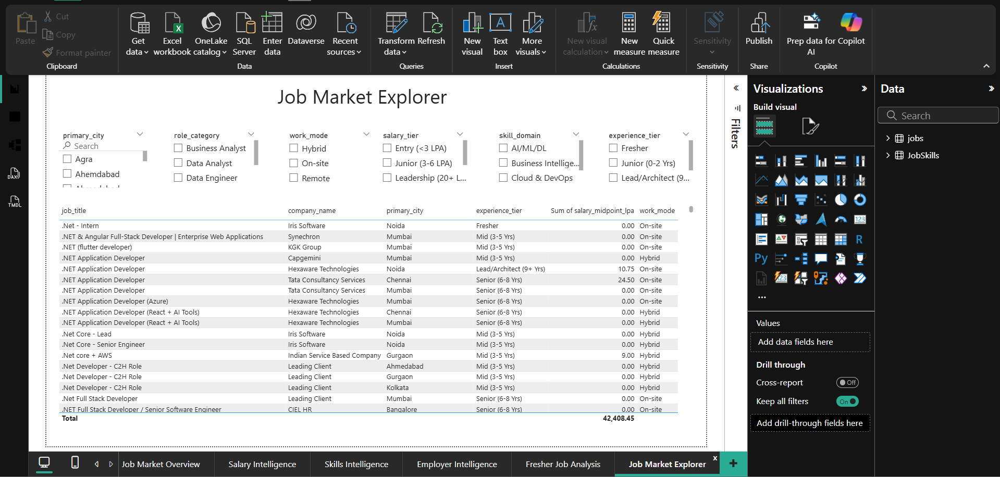

# 🇮🇳 Indian Tech Job Market Analytics — Power BI

An interactive **Power BI Business Intelligence dashboard** designed to analyze the Indian technology job market using **23,000+ job postings**.

The project explores hiring demand, salary trends, experience requirements, in-demand technical skills, company hiring activity, work modes, and fresher-friendly opportunities.

---

## 📊 Project Overview

The Indian technology job market contains a large amount of information across job roles, companies, cities, salaries, required skills, experience levels, and work arrangements.

The goal of this project is to transform raw job-posting data into an interactive business intelligence dashboard that helps users understand:

* Where technology jobs are concentrated
* Which roles have the highest hiring demand
* Which technical skills employers request most frequently
* How salaries vary by role and location
* How experience requirements relate to salary
* Which companies are hiring most frequently
* How job opportunities differ by work mode
* Where fresher-friendly opportunities are available
* Which skill domains are most represented in the market

---

# 🎯 Business Objectives

The dashboard was designed to answer the following business questions:

### Job Market

* How many technology jobs are available in the dataset?
* Which cities have the highest number of job postings?
* Which job roles have the highest hiring demand?
* What is the distribution of jobs by experience level?

### Salary

* What is the average advertised salary?
* Which roles have higher salary ranges?
* How does salary vary across cities?
* Does salary increase with experience?
* What percentage of jobs disclose salary information?

### Skills

* Which technical skills are most frequently requested?
* Which skill domains are most common?
* Which skills are associated with different job roles?
* How many skills are typically requested per job?

### Companies

* Which companies have the highest number of job postings?
* How does hiring activity vary by company size?
* Is there a relationship between company rating and hiring volume?

### Fresher Opportunities

* How many jobs are classified as fresher-friendly?
* Which cities have the most fresher-friendly opportunities?
* Which roles offer the most entry-level opportunities?
* How are fresher opportunities distributed across work modes?

---

# 🛠️ Tools & Technologies

| Tool        | Purpose                                 |
| ----------- | --------------------------------------- |
| Power BI    | Dashboard development and visualization |
| Power Query | Data cleaning and transformation        |
| DAX         | Measures and analytical calculations    |
| CSV         | Source dataset                          |
| GitHub      | Project documentation and portfolio     |
| Excel       | Data inspection and validation          |

---

# 📁 Dataset

The dataset contains **23,000+ technology job postings** with information including:

* Job ID
* Job title
* Company
* Company rating
* Location
* City
* Role category
* Minimum experience
* Maximum experience
* Salary range
* Salary disclosure status
* Required skills
* Number of skills
* Work mode
* Company size
* Job posting date
* Salary tier
* Experience tier
* Skill domain
* Fresher-friendly indicator
* Salary negotiability

---

# 🧹 Data Preparation

The dataset was prepared using **Power Query** before building the dashboard.

The main preparation steps included:

1. Imported the CSV dataset into Power BI.
2. Reviewed column names and data types.
3. Corrected numeric, text, and Boolean data types.
4. Checked missing and invalid values.
5. Preserved undisclosed salary records instead of removing them.
6. Used the `salary_disclosed` field to distinguish disclosed and undisclosed salary information.
7. Reviewed experience and salary fields.
8. Created a separate `JobSkills` table for individual skill-level analysis.
9. Split the multi-value `skills_required` field into individual skill rows.
10. Created a relationship between the Jobs and JobSkills tables using `job_id`.

---

# 🧩 Data Model

The primary dataset is stored in the `Jobs` table.

A separate `JobSkills` table was created because multiple skills can exist inside a single job record.

Example:

```text
Jobs

job_id | job_title       | skills_required
---------------------------------------------
101    | Data Analyst    | Python, SQL, Power BI
```

was transformed into:

```text
JobSkills

job_id | skill
--------------
101    | Python
101    | SQL
101    | Power BI
```

This allows individual skills to be counted and analyzed correctly.

---

# 📊 Dashboard Pages

## 1. Market Overview

Provides a high-level view of the technology job market.

### KPIs

* Total Jobs
* Total Companies
* Total Cities
* Fresher Jobs

### Visualizations

* Jobs by City
* Jobs by Role
* Jobs by Work Mode
* Jobs by Experience Level

---

## 2. Salary Intelligence

Analyzes salary patterns across roles, cities, and experience levels.

### KPIs

* Average Salary
* Maximum Salary
* Minimum Salary
* Salary Disclosure %

### Visualizations

* Average Salary by Role
* Average Salary by City
* Salary vs Experience
* Salary Tier Distribution

---

## 3. Skills Intelligence

Analyzes the technical skills requested by employers.

### KPIs

* Unique Skills
* Skill Mentions
* Jobs With Skills
* Average Skills per Job

### Visualizations

* Top 10 Skills
* Skill Domain Distribution
* Jobs by Skill Domain
* Skill × Role Matrix
* Skill Detail Table

---

## 4. Company Analysis

Analyzes employer hiring activity.

### Visualizations

* Top Hiring Companies
* Company Rating vs Jobs
* Jobs by Company Size
* Hiring Activity by Company

---

## 5. Fresher Opportunities

Focuses on entry-level and fresher-friendly positions.

### KPIs

* Fresher Jobs
* Fresher Job %
* Fresher Jobs With Salary
* Fresher Salary Disclosure %

### Visualizations

* Fresher Jobs by City
* Fresher Jobs by Role
* Fresher Jobs by Work Mode
* Fresher Jobs by Experience Tier

---

## 6. Job Explorer

An interactive detailed job-search page.

Users can filter jobs by:

* City
* Role
* Experience
* Work Mode
* Salary Tier
* Skill Domain
* Company Size

The page provides detailed job-level information including company, role, location, experience, salary, work mode, and job posting information.

---

# 📐 Key DAX Measures

### Total Jobs

```DAX
Total Jobs =
COUNTROWS(Jobs)
```

### Total Companies

```DAX
Total Companies =
DISTINCTCOUNT(Jobs[company_name])
```

### Total Cities

```DAX
Total Cities =
DISTINCTCOUNT(Jobs[primary_city])
```

### Average Salary

Salary calculations only consider jobs where salary information is disclosed.

```DAX
Average Salary =
CALCULATE(
    AVERAGE(Jobs[salary_midpoint_lpa]),
    Jobs[salary_disclosed] = TRUE()
)
```

### Maximum Salary

```DAX
Maximum Salary =
CALCULATE(
    MAX(Jobs[salary_max_lpa]),
    Jobs[salary_disclosed] = TRUE()
)
```

### Fresher Jobs

```DAX
Fresher Jobs =
CALCULATE(
    [Total Jobs],
    Jobs[is_fresher_friendly] = TRUE()
)
```

### Fresher Job %

```DAX
Fresher Job % =
DIVIDE(
    [Fresher Jobs],
    [Total Jobs],
    0
)
```

### Salary Disclosure %

```DAX
Salary Disclosure % =
DIVIDE(
    CALCULATE(
        [Total Jobs],
        Jobs[salary_disclosed] = TRUE()
    ),
    [Total Jobs],
    0
)
```

---

# 🔍 Key Analytical Areas

The dashboard focuses on five major areas:

```text
Job Demand
     ↓
Salary
     ↓
Skills
     ↓
Companies
     ↓
Fresher Opportunities
```

This allows the project to move beyond simple visualization and provide a structured view of the job market.

---

# 💡 Business Insights

The dashboard can be used to identify:

* Major technology hiring locations
* High-demand technology roles
* Frequently requested technical skills
* Salary differences between roles and cities
* Experience requirements across positions
* Employer hiring patterns
* Work-mode distribution
* Fresher-friendly job opportunities
* Skill-domain demand

> Insights should be interpreted directly from the dashboard and dataset rather than assumed before analysis.

---

# 📸 Dashboard Preview

### Market Overview



### Salary Intelligence



### Skills Intelligence



### Company Analysis



### Fresher Opportunities



### Job Explorer



---

# 🚀 How to Use

1. Download or clone this repository.
2. Open the `.pbix` file using Power BI Desktop.
3. Review the dashboard pages.
4. Use the slicers to filter the analysis.
5. Explore job, salary, skill, company, and fresher-level insights.

---

# 📂 Repository Structure

```text
indian-tech-job-market-analytics-powerbi/
│
├── PowerBI/
│   └── Indian_Tech_Job_Market_Analytics.pbix
│
├── Dataset/
│   └── indian_tech_jobs_2026.csv
│
├── Screenshots/
│   ├── 01_market_overview.png
│   ├── 02_salary_intelligence.png
│   ├── 03_skills_intelligence.png
│   ├── 04_company_analysis.png
│   ├── 05_fresher_opportunities.png
│   └── 06_job_explorer.png
│
├── DAX/
│   └── measures.md
│
├── Documentation/
│   ├── data_dictionary.md
│   └── project_methodology.md
│
└── README.md
```

---

# 📌 Project Skills Demonstrated

### Power BI

* Dashboard Development
* Data Modeling
* Interactive Visualizations
* Slicers
* Drill-through
* Tooltips
* Conditional Formatting

### Power Query

* Data Cleaning
* Data Transformation
* Data Type Management
* Column Transformation
* Multi-value Column Transformation

### DAX

* `COUNTROWS`
* `DISTINCTCOUNT`
* `CALCULATE`
* `AVERAGE`
* `MAX`
* `DIVIDE`
* Filter Context
* KPI Measures

### Data Analytics

* Exploratory Data Analysis
* Job Market Analysis
* Salary Analysis
* Skill Demand Analysis
* Hiring Trend Analysis
* Segmentation

---

# 🎓 Portfolio Project

This project was developed as a **Data Analyst / Business Intelligence portfolio project** to demonstrate practical skills in:

**Power BI + Power Query + DAX + Data Analysis + Data Visualization**

---

## Author

**Harsh Verma**

Data Analyst | Power BI | SQL | Python | Excel

GitHub: [Add your GitHub profile]

LinkedIn: [Add your LinkedIn profile]

---

## ⭐ If you find this project useful

Feel free to explore the repository, review the Power BI dashboard, and use the project as a reference for learning data analytics and business intelligence.
